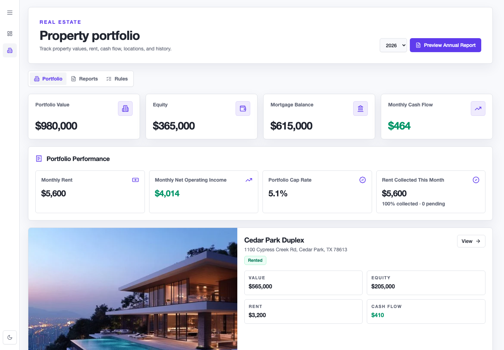
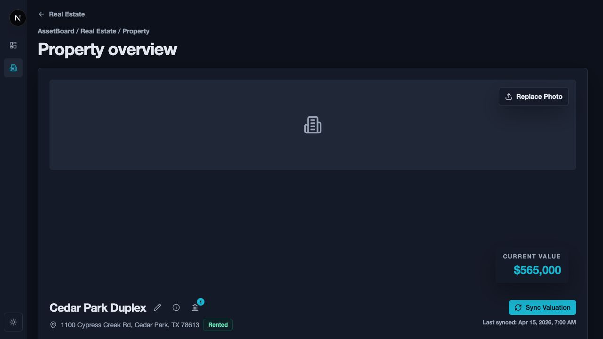
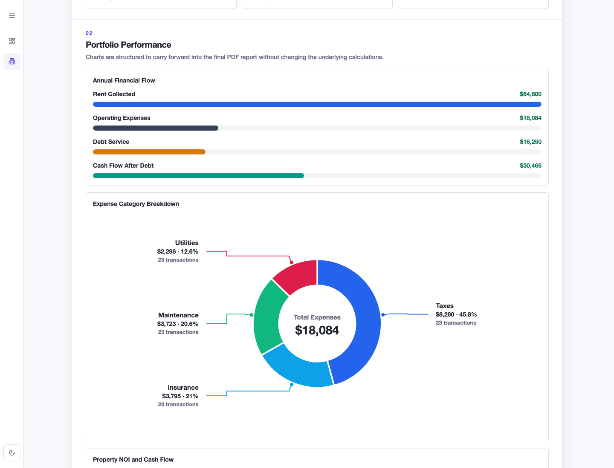

# AssetBoard

AssetBoard is a self-hosted real estate asset-management MVP for tracking rental
property performance. It combines a household portfolio overview with property
dashboards, monthly rent and expense review, bank transaction workflows, and
annual CSV reporting for tax or accounting review.

This project is intentionally practical rather than decorative: it is built for
repeated property operations, not for marketing pages or broad personal-finance
automation.

## What It Does

- Tracks a household portfolio with a real estate focus.
- Shows property-level value, equity, rent, mortgage balance, cash flow, NOI,
  cap rate, expense ratio, and historical trends.
- Supports monthly review workflows for rent collection and operating expenses.
- Connects bank transactions through Plaid when explicitly enabled and configured.
- Uses transaction rules to classify recurring property expenses more quickly.
- Produces an annual real estate CSV export with rent, expenses, property
  summaries, and transaction appendices.
- Keeps development and browser tests fixture-first so normal verification does
  not call Supabase, Plaid, RentCast, or Mapbox.

## Screenshots

These screenshots use deterministic fixture financial data from the browser
verification suite. They do not show live account data or call paid external
APIs. The property photo is illustrative; replace it before publishing if the
image itself is sensitive.







## Important User Notes

- AssetBoard is not financial, legal, or tax advice. Review exports with a
  qualified professional before using them for filings or decisions.
- This is a self-hosted MVP. You are responsible for deployment, secrets, data
  security, backups, and access control.
- The current app password gate is beta access control only. It is not per-user
  authentication, does not identify who changed data, and should be replaced
  with stronger auth before broader multi-user use.
- Plaid usage can affect billing. Keep bank workflows manual-first, review your
  Plaid plan before production use, and remove unused Items when appropriate.
- Do not commit `.env.local`, private keys, Plaid secrets, Supabase service-role
  keys, RentCast keys, or other credentials.
- Treat property addresses, transaction descriptions, account names, and exports
  as sensitive personal financial data.

## Developer Notes

AssetBoard is a Next.js app backed by Supabase. Plaid, RentCast, and Mapbox are
optional integrations behind environment configuration. The default development
posture should stay mock-provider and fixture-first so UI and test work does not
consume paid or limited API calls.

Key implementation expectations:

- Use mock providers for normal local development.
- Do not add background Plaid sync, extra Plaid products, or live API calls
  without reviewing cost and product need.
- Keep customer-facing UI generic. For example, prefer "Current Value" or
  "Property Valuation" over foregrounding vendor names.
- Keep transaction-ledger data as the source of truth for YTD and annual report
  metrics where real bank/API data exists.
- Keep setup and admin workflows secondary to the property performance dashboard.

Easy-to-forget operational notes:

- To change the shared login password, update `ASSETBOARD_SITE_PASSWORD` in
  local `.env.local` and in the deployment environment, then restart or redeploy.
  The current password gate sets a one-day signed cookie, so rotating this value
  forces users to log in again.
- To add a bank account through Plaid, temporarily set
  `NEXT_PUBLIC_ALLOW_DIRECT_PLAID_LINK=1`, restart the app so the client bundle
  picks it up, complete the Add Accounts or Connect Accounts flow, then set the
  value back to `0` and restart or redeploy again.
- Real Plaid linking also requires `BANK_TRANSACTION_PROVIDER=plaid`,
  `PLAID_CLIENT_ID`, `PLAID_SECRET`, `PLAID_ENV`, and `PLAID_REDIRECT_URI`.
  Keep `BANK_TRANSACTION_PROVIDER=mock` for normal local development and tests.
- Keep `PLAID_REDIRECT_URI` matched to the exact app host and
  `/real-estate/plaid/oauth` path being used, and make sure the same redirect URI
  is allowed in the Plaid Dashboard.
- Any `NEXT_PUBLIC_*` environment variable is included in the browser bundle.
  Restart `npm run dev` locally or redeploy the app after changing one.
- Keep `PROPERTY_VALUATION_PROVIDER=mock` unless deliberately testing valuation
  sync. Switching to a live provider requires `RENTCAST_API_KEY` and can consume
  quota.
- Use `ASSETBOARD_E2E_FIXTURES=1` only for deterministic browser verification
  and README-style screenshots. It bypasses live Supabase, Plaid, RentCast, and
  Mapbox data paths by design.

For Plaid-specific production guidance, read
[`docs/plaid-production-readiness.md`](docs/plaid-production-readiness.md).

For browser verification and fixture-mode details, read
[`docs/browser-verification.md`](docs/browser-verification.md).

## Local Setup

Install dependencies:

```bash
npm install
```

Create local environment values from the example:

```bash
cp .env.example .env.local
```

Recommended local defaults:

```env
BANK_TRANSACTION_PROVIDER=mock
PROPERTY_VALUATION_PROVIDER=mock
NEXT_PUBLIC_ALLOW_DIRECT_PLAID_LINK=0
PLAID_ENV=sandbox
```

Start the development server:

```bash
npm run dev
```

Run the main checks:

```bash
npm run lint
npm run build
```

Run focused real estate tests:

```bash
npm run test:real-estate-provider-containment
npm run test:real-estate-monthly-review
npm run test:real-estate-quality
npm run test:real-estate-export
npm run test:real-estate-statement
npm run test:real-estate-history
```

Run browser smoke tests with deterministic fixture data:

```bash
npm run test:e2e
```

## Environment Variables

See [`.env.example`](.env.example) for the full list. The most important groups
are:

- Supabase: `NEXT_PUBLIC_SUPABASE_URL`, `SUPABASE_SERVICE_ROLE_KEY`
- Site access: `ASSETBOARD_SITE_PASSWORD`
- Maps: `NEXT_PUBLIC_MAPBOX_ACCESS_TOKEN`
- Valuation: `PROPERTY_VALUATION_PROVIDER`, `RENTCAST_API_KEY`
- Banking: `BANK_TRANSACTION_PROVIDER`, `PLAID_CLIENT_ID`, `PLAID_SECRET`,
  `PLAID_ENV`, `PLAID_REDIRECT_URI`
- Account linking UI: `NEXT_PUBLIC_ALLOW_DIRECT_PLAID_LINK`,
  `NEXT_PUBLIC_ACCOUNT_LINKING_REQUEST_EMAIL`

Use production credentials only in trusted deployment environments. Keep local
development on mock providers unless you are deliberately testing a real
integration.

## Docs

- [Browser Verification](docs/browser-verification.md)
- [Plaid Production And Cost Safety Checklist](docs/plaid-production-readiness.md)
